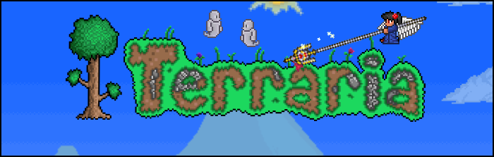

# mt (Modding Terraria codename; desktop-uwp-1.3 branch)

## The object to explore

:: Terraria 1.3.x.x ::

## Progress of porting to uwp

:: Draft ::

### Content
This repo contains the decompiled source of the Terraria client binaries, from version 1.3.x.x. Decompiled with [JetBrains dotPeek](https://www.jetbrains.com/decompiler/). 

### Important
- This repo does not include the game content.
If you want the content, buy the game on Steam, then place it at *Src\Contents* folder. 
- Use this at your own risk: I am not responsible for any legal consequences that may occur by using this decompiled code, nor will I provide support for it.
I am just providing the decompiled code as a reference and making it easily accessible on GitHub.

## Todo
- Explore all code structures :
- Try to patch decomp. bugs :
- Research game mechanics :
- Do something else (port to w10m why not?) : :

## Add. info / References
- https://onlineblogzone.com/modding-terraria-part-1-getting-started/ Modding Terraria – Part 1 Getting Started (article)
- https://github.com/TheVamp/Terraria-Source-Code  Version 1.2.0.3.1 (decomp/raw)
- https://github.com/UTINKA/Terraria Terraria Version 1.3.5.3 (decomp/raw)
- https://github.com/MikeyIsBaeYT/Terraria-Source-Code Version ??? (decomp/raw)
- https://habr.com/ru/articles/142349/ Terraria: или пишите игры правильно (in Rus.)
- https://habr.com/ru/articles/122839/ Игра «Terraria» и её «хорошая» система шифрования профайлов (in Rus.)

## ..
As is. No support. Educational use/purpose only. DIY

## .
[m][e] 2023
