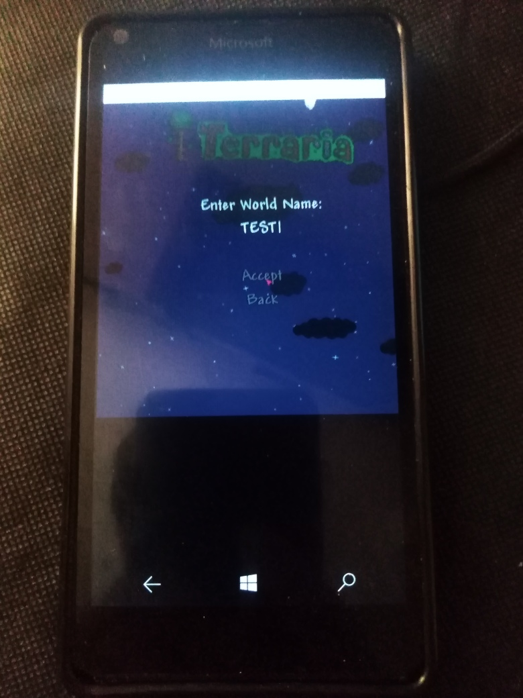

# mt-1.0-beta1 (Project [M]icro[T]erraria codename; 1.0-beta-uwp branch)
This is MINIMAL UWP Terraria app. It's my own attempt to RnD of Terraria XNA game mechanics.

:: Min. Win. os build (SDK): 10240 (Astoria compatibility added)

## Screenshot(s)

## Progress of porting to uwp

:: Touch control seems to be ok... but buggy =) After long play "finger touch" counting autoincrementing occccccccurs.... =))))

:: Background music recovered (but wavebank after xbox->pc convert. is HUGE at now!)) 

:: DB storage ok

:: Some debug mode added (but remerked/commented partially... only "god mode for life autosaving" on at now)))

:: Some modded content added ... but all old terreria 1.0 theme remained, of couse! 

:: DB "auto-deploy" fixed. So, terraria.bd file will automatically copied to AppData\Local\Packages\ME.ModdingTerrariaV1_...\LocalState  at first app start :)

:: The app do its work only at "start mode" (minimum WASD + UpDownLeftRight keyboard control, not touchscreen event yet, sadly...) 

:: Sounds ok, and Music ok (wavebank consists of 5 Terraria-themed WAV)

:: Game save / restore settings (player/genworld data storage) seem to be fixed (?) too

### Content
This repo contains the decompiled source of the Terraria client binaries, from version 1.0-beta founded at [Terraria-pc-version-archive site](https://archive.org/details/terraria-pc-version-archive). Decompiled with [JetBrains dotPeek](https://www.jetbrains.com/decompiler/). 

### Important
- If you want to fix music themes, find cool utils for modding music content, and use *Src\Contents\Wave Bank.xbw* (unpack it, explore Xbox row RIFF format, recode all music files, pack them...). 
- Use this at your own risk: I am not responsible for any legal consequences that may occur by using this decompiled code, nor will I provide support for it.
I am just providing the decompiled code as a reference and making it easily accessible on GitHub.

## Todo
- Explore all code structures : :
- Try to patch decomp. bugs : :
- Research game mechanics : :
- Add your own game mech
- Fix music : :
- Upprove touchscreen event handlers : :
- Mouse handling (for desktop mode) also needed  : :
- Do something else (deploy to old swwet Lumia phones... why not?) : :

## Add. info / References
- https://onlineblogzone.com/modding-terraria-part-1-getting-started/ Modding Terraria – Part 1 Getting Started (article)
- https://github.com/TheVamp/Terraria-Source-Code  Version 1.2.0.3.1 (decomp/raw)
- https://github.com/UTINKA/Terraria Terraria Version 1.3.5.3 (decomp/raw)
- https://github.com/MikeyIsBaeYT/Terraria-Source-Code Version ??? (decomp/raw)
- https://habr.com/ru/articles/142349/ Terraria: или пишите игры правильно (in Rus.)
- https://habr.com/ru/articles/122839/ Игра «Terraria» и её «хорошая» система шифрования профайлов (in Rus.)

## ..
As is. No support. Educational use/purpose only. DIY

## .
[m][e] 2023
